## Q0.1

For the fundamental matrix, we know that $x^{\prime T} F x = 0$
Writing out the equation, we get:
$$
\left[\begin{array}{lll}
x_i^{\prime} & y_i^{\prime} & 1
\end{array}\right]\left[\begin{array}{lll}
F_{11} & F_{12} & F_{13} \\
F_{21} & F_{22} & F_{23} \\
F_{31} & F_{32} & F_{33}
\end{array}\right]\left[\begin{array}{l}
x_i \\
y_i \\
1
\end{array}\right]=\left[\begin{array}{l}
0 \\
0 \\
0
\end{array}\right]
$$
Substitute center of image in the equation, we get:
$$\left[\begin{array}{lll}
0 & 0 & 1
\end{array}\right]\left[\begin{array}{lll}
F_{11} & F_{12} & F_{13} \\
F_{21} & F_{22} & F_{23} \\
F_{31} & F_{32} & F_{33}
\end{array}\right]\left[\begin{array}{l}
0 \\
0 \\
1
\end{array}\right]=\left[\begin{array}{l}
0 \\
0 \\
0
\end{array}\right]
$$

This gives, $F_{3,3} = 0$


<p style="page-break-after: always;">&nbsp;</p>

## Q0.2
Consider the case of two cameras viewing an object such that the second camera differs from the first by a pure translation that is parallel to the $x$-axis. Show that the epipolar lines in the two cameras are also parallel to the $x$-axis. Backup your argument with relevant equations.

Since we have a pure translation parallel to the x axis, we get 
$E = t_{X}R = t_{X}$, since $R = I$ (no rotation).

Since we have a translation only about the x axis, our essential matrix becomes:

$$
E = \left[\begin{array}{lll}
0 & 0 & 0 \\
0 & 0 & -t_x \\
0 & t_x & 0
\end{array}\right]
$$

Our epipolar lines are given by $Ex = l^{\prime}$. Hence our line is dictated by

$$
l^{\prime} = Ex = \left[\begin{array}{lll}
0 & 0 & 0 \\
0 & 0 & -t_x \\
0 & t_x & 0
\end{array}\right] \left[\begin{array}{lll}
x_i \\
y_i \\
1
\end{array}\right]  = \left[\begin{array}{lll}
0 \\
-t_x  \\
y_i t_x
\end{array}\right]
$$


We get a normal vector of the epipolar line of the form $<0, \beta, \gamma>$, which means that the line is parallel to the x-axis.

<p style="page-break-after: always;">&nbsp;</p>

## Q0.3

We know that the mapping from the 3D scene to the camera coordinates are dictated by the equation $x = K(RX + t)$. In this case, since we are to find the relative orientation between 2 camera orientations, let us simply consider the extrinsic parameters which will be $x_1 = RX + t$.

For both cameras, we get: $x_1 = R_1 X + t_1$, and $x_2 = R_2 X + t_2$.

Substituting equation 1 in equation 2 and eliminating $X$, we get $x_2 = R_2 R_1^{-1}x_1 - R_2R_1^{-1}t_1 + t_2$. This gives the relative rotation and translation as:

$$ R_{rel} = R_2 R_1^{-1}$$

$$ t_{rel} = - R_2R_1^{-1}t_1 + t_2 $$


Hence, the fundamental matrix and essential matrix will be:

$$ E = [t_{rel}]_{\times} R_{rel}$$

$$ F = (K^{-1}) ^ T E K^{-1} = (K^{-1}) ^ T [t_{rel}]_{\times} R_{rel} K^{-1} $$

<p style="page-break-after: always;">&nbsp;</p>

## Q0.4

Suppose that a camera views an object and its reflection in a plane mirror. Show that this situation is equivalent to having two images of the object which are related by a skew-symmetric fundamental matrix. You may assume that the object is flat, meaning that all points on the object are of equal distance to the mirror (**Hint:** draw the relevant vectors to understand the relationship between the camera, the object, and its reflected image.)


Let us take the case where the image plane is perpendicular to the mirror. The camera views 2 copies of the object - 1 where the actual image is placed and 2) from the location of the reflected image. Mathematically, we can describe the image and its point on the camera plane as $x = PX$ and $x = PTX$, where $T$ is some transformation on the original image that gives rise to the reflection of the object on the image. This is akin to observing the object and its reflection separately in two images given by 2 cameras with matrices $P, PT$ - this essentially describes two different viewpoints of the same object placed at X!

Without loss of generality, let us assume that the camera plane is placed perpendicular to the mirror. This means that the reflection of the object will be a simple translation along the image plane. This means that there is no rotation involved between the two views from the discussion in the above paragraph.


We can hence write our essential matrix as $E = [t]_{\times} R = [t]_{\times}$ as $R=I$. Now, we can say that $E = [t]_{\times}$ which is skew symmetric by definition of the $[t]_{\times}$ vector.

hence, our fundamental matrix then becomes 

$$ F = (K^{-1}) ^ T E K^{-1} = (K^{-1}) ^ T [t_{rel}]_{\times}K^{-1} $$


Let us now check if the fundamental matrix is skew symmetric ($F^T = -F$).

$$
F^T = ((K^{-1}) ^ T E K^{-1})^T = (K^{-1}) ^ T E^T K^{-1}
$$

Since $E$ is skew symmetric as discussed previously, we get: $E^T = -E$. This gives:


$$
F^T = (K^{-1}) ^ T (-E) K^{-1} = -F
$$

Hence, F is skew symmetric.

<p style="page-break-after: always;">&nbsp;</p>

# Coding Questions

## Q1.1

The recovered F is:
```
F = [[-0.      0.     -0.2519]
 [ 0.     -0.      0.0026]
 [ 0.2422 -0.0068  1.    ]]
Error: 0.39895034989884903
```

Some outputs points from the display function.
  

<p style="page-break-after: always;">&nbsp;</p>

## Q1.2
The predicted F
```
F = [[ 0.      0.     -0.201 ]
 [ 0.     -0.      0.0007]
 [ 0.1922 -0.0042  1.    ]]
Error =  0.5668901239522244
```
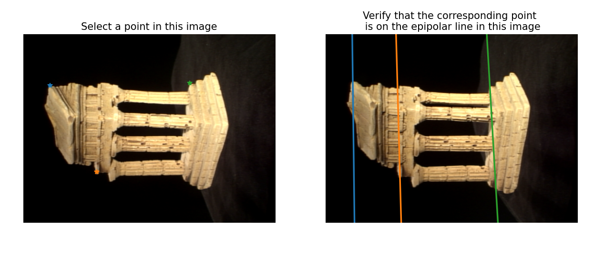  

<p style="page-break-after: always;">&nbsp;</p>

## Q2.2

Let $P$ be the projective matrix of the camera.

$$
P = \left[\begin{array}{ll}
\boldsymbol{p}_1^{\top} \\
\boldsymbol{p}_2^{\top} \\
\boldsymbol{p}_3^{\top}
\end{array}\right]
$$

$\boldsymbol{p}_i^{\top}$ is the row of the projective matrix of the camera. Let $x, y$ be the 2D projection of the point on the image. We can write $A_i$ as:

$$
A_i = \left[\begin{array}{c}
y \boldsymbol{p}_3^{\top}-\boldsymbol{p}_2^{\top} \\
\boldsymbol{p}_1^{\top}-x \boldsymbol{p}_3^{\top} \\
y^{\prime} \boldsymbol{p}_3^{\prime \top}-\boldsymbol{p}_2^{\prime \top} \\
\boldsymbol{p}_1^{\prime \top}-x^{\prime} \boldsymbol{p}_3^{\prime \top}
\end{array}\right]
$$

<p style="page-break-after: always;">&nbsp;</p>

## Q2.3

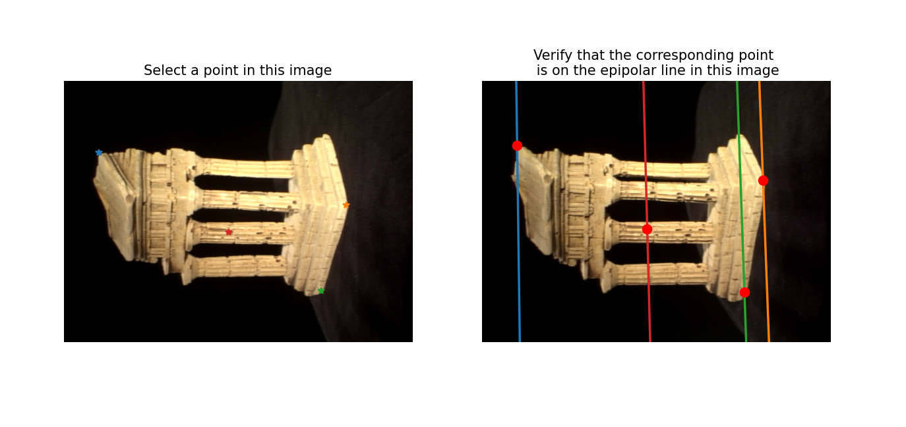  

Here it is clear that the points are detected correctly.

<p style="page-break-after: always;">&nbsp;</p>

## Q2.4

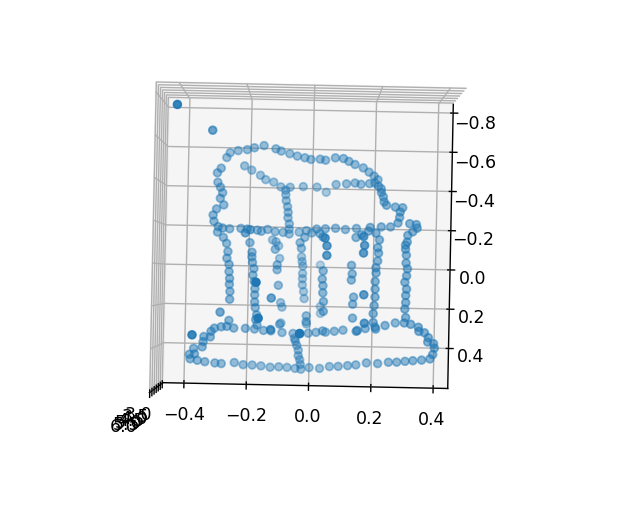

<p style="page-break-after: always;">&nbsp;</p>


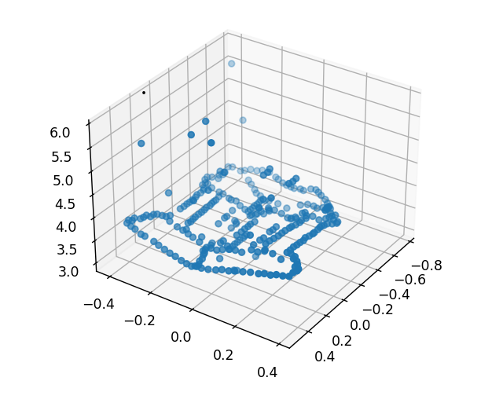  

<p style="page-break-after: always;">&nbsp;</p>


## Q2.5

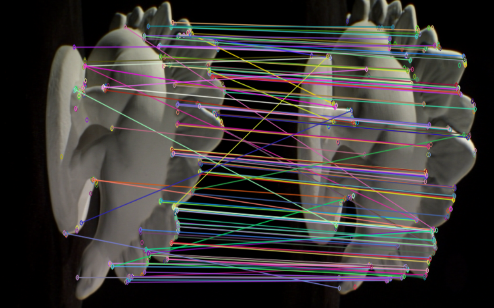  

Correspondence matches. Computed using ORB descriptor and brute force matcher inbuilt in OpenCV.

<p style="page-break-after: always;">&nbsp;</p>


Reconstructions:

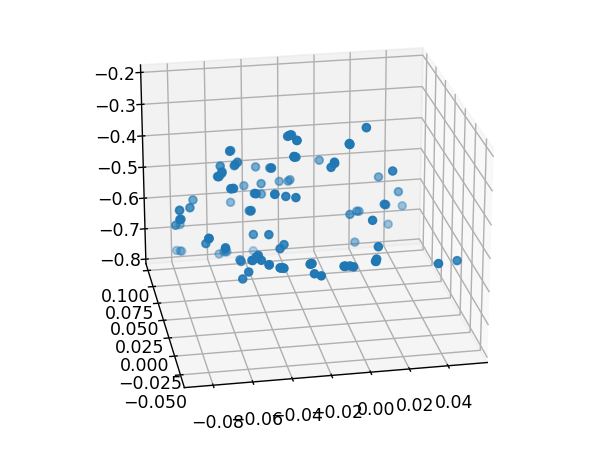 
<p style="page-break-after: always;">&nbsp;</p>

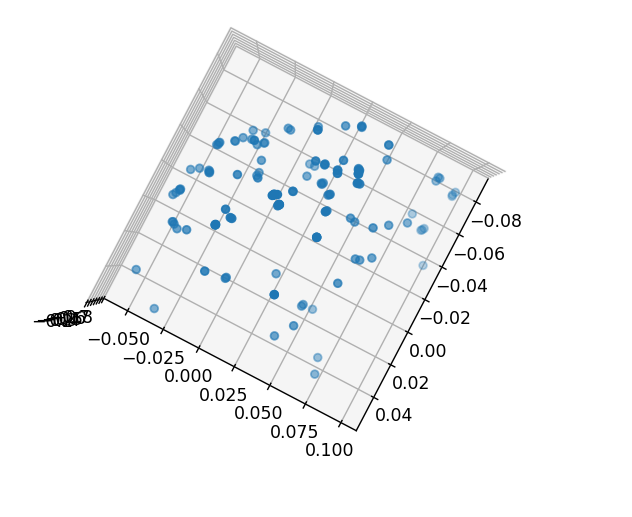  

<p style="page-break-after: always;">&nbsp;</p>


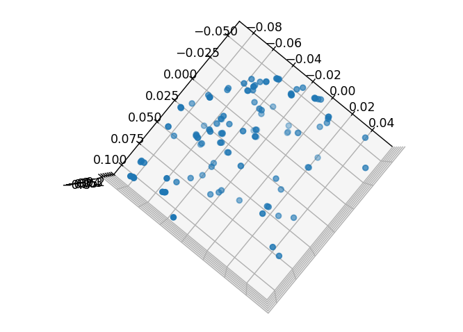  

<p style="page-break-after: always;">&nbsp;</p>


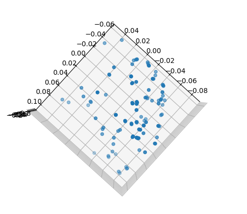  

In the above images, the rough shape of the spikes of the dinosaur can be seen. As the feature points are sparse, it is not very clearly visible, but the rough shape can be seen.

<p style="page-break-after: always;">&nbsp;</p>


The original images are:

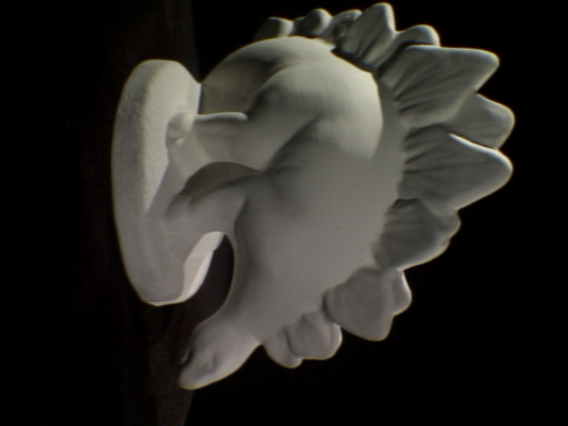

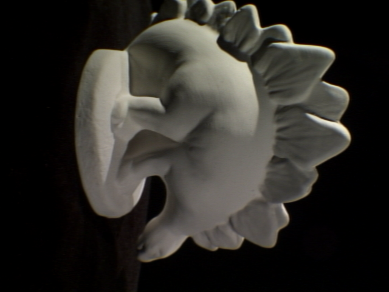


This is from the DinoSparseRing dataset from the provided links. images dinoSR0001 and dinoSR0002 are chosen. The relative change in angle between the 2 images is ~22.5 degrees. The fundamental matrix was estimated using RANSAC and 7 point algorithm.

<p style="page-break-after: always;">&nbsp;</p>


## Q3.3

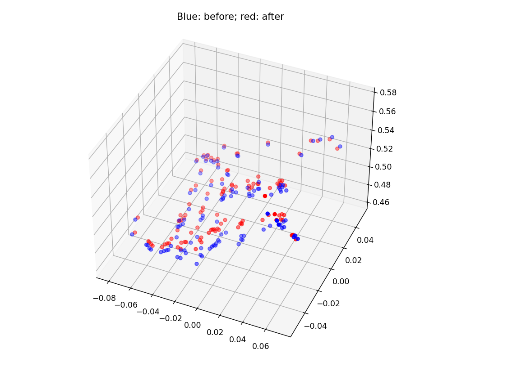  
(CG optimizer)
Errors: before 9170.318705933929, After 4145.34978423357

<p style="page-break-after: always;">&nbsp;</p>


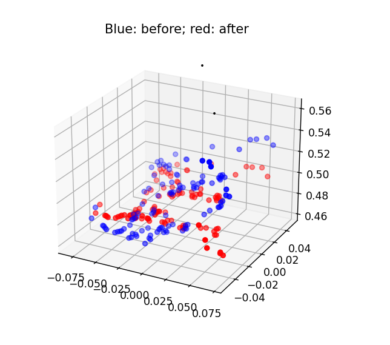  
(Powell optimizer)

Errors: before 9170.318705933929, After 1828.3868371985636

<p style="page-break-after: always;">&nbsp;</p>


## Discussion

Conceptual discussion was carried out with the following students:
- Siddharth Saha
- Ronit Hire